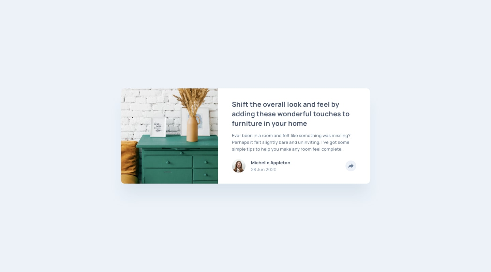

# Article Preview Component


## 📋 Overview

This is a solution to the [Article preview component challenge on Frontend Mentor](https://www.frontendmentor.io/challenges/article-preview-component-dYBN_pYFT). Frontend Mentor challenges help you improve your coding skills by building realistic projects.

### ✨ The Challenge

Users should be able to:

- View the optimal layout for the component depending on their device's screen size
- See the social media share links when they click the share icon
- See hover states for all interactive elements on the page

### 🎯 Screenshot




## 🚀 Live Demo

[Live Demo URL](https://your-username.github.io/article-preview-component/)

## 🛠️ Built With

- Semantic HTML5 markup
- CSS custom properties (variables)
- Flexbox
- Mobile-first workflow
- Fluid typography with `clamp()`
- Vanilla JavaScript

## 📦 What I Learned

### CSS Variables (Custom Properties)
```css
:root {
  --color-very-dark-grayish-blue: hsl(217, 19%, 35%);
  --color-desaturated-dark-blue: hsl(214, 17%, 51%);
  --color-grayish-blue: hsl(212, 23%, 69%);
  --color-light-grayish-blue: hsl(210, 46%, 95%);
}
